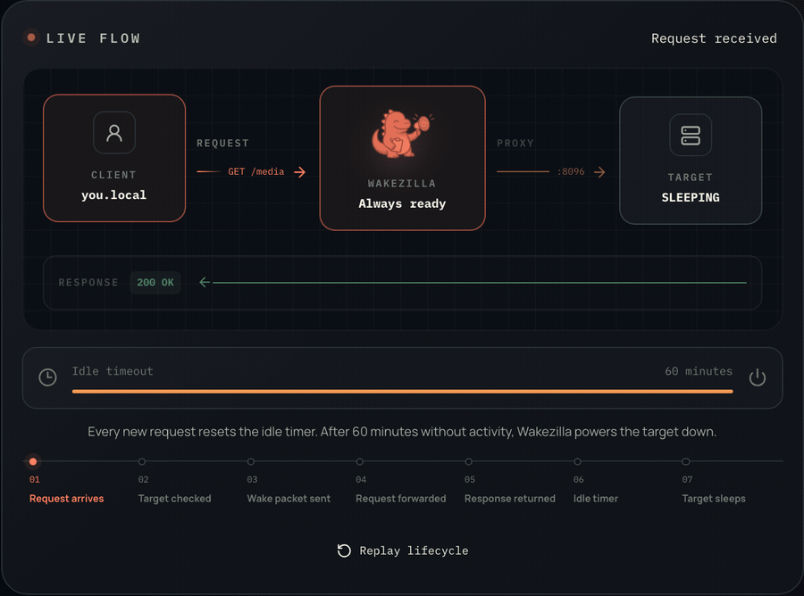

# Wakezilla 🦖

[](https://crates.io/crates/wakezilla)
[](LICENSE)
[](https://github.com/guibeira/wakezilla/actions/workflows/ci.yml)

<p align="center">
  
</p>

Wakezilla wakes machines on demand, forwards traffic to them, and can shut them
down again after a period of inactivity. Manage everything from a web dashboard,
terminal UI, or desktop tray.

[Documentation](https://wakezilla.dev/docs/) ·
[Installation](https://wakezilla.dev/docs/getting-started/installation/) ·
[Quick start](https://wakezilla.dev/docs/getting-started/quick-start/) ·
[Releases](https://github.com/guibeira/wakezilla/releases)

## See it in action



## Features

- Wake machines remotely with Wake-on-LAN.
- Forward TCP services and wake their target machine automatically.
- Manage machines, ports, activity, and network discovery from the web dashboard.
- Shut down idle machines through authenticated proxy-to-client requests.
- Run the proxy and client as native system services.
- Operate Wakezilla through the web, terminal UI, or desktop tray.

## How it works

Wakezilla's proxy runs on an always-on machine. When traffic reaches a configured
port, it wakes the target machine and forwards the connection. An optional client
service on the target machine enables authenticated remote and automatic shutdown.

See [How Wakezilla works](https://wakezilla.dev/docs/getting-started/how-it-works/)
for the architecture, network flow, and deployment model.

## Get started

Use the documentation for current platform requirements, installers, Docker,
service setup, and the first machine configuration:

1. [Install Wakezilla](https://wakezilla.dev/docs/getting-started/installation/).
2. Follow the [quick start](https://wakezilla.dev/docs/getting-started/quick-start/).
3. Open the [web dashboard guide](https://wakezilla.dev/docs/guides/web-dashboard/).

## Docs

[Read the Wakezilla documentation](https://wakezilla.dev/docs/).

## Development

Wakezilla is a Rust workspace with a Leptos frontend. Run Rust tooling directly:

```bash
cargo fmt --all -- --check
cargo clippy --workspace --all-targets --locked -- -D warnings
cargo test --workspace --locked
```

For local development, start the frontend from `frontend/` with `trunk serve`
and run the proxy from the repository root with `cargo run -- proxy-server`.

Issues and pull requests are welcome. Please include tests for behavior changes
and keep the standard checks green.

## Security

Wakezilla is designed primarily for trusted networks. Client shutdown requests
can be authenticated, but access to the dashboard and API must be restricted
separately. Review the [security guide](https://wakezilla.dev/docs/reference/security/)
before exposing Wakezilla outside a private network.

## License

Wakezilla is available under the [MIT License](LICENSE).
